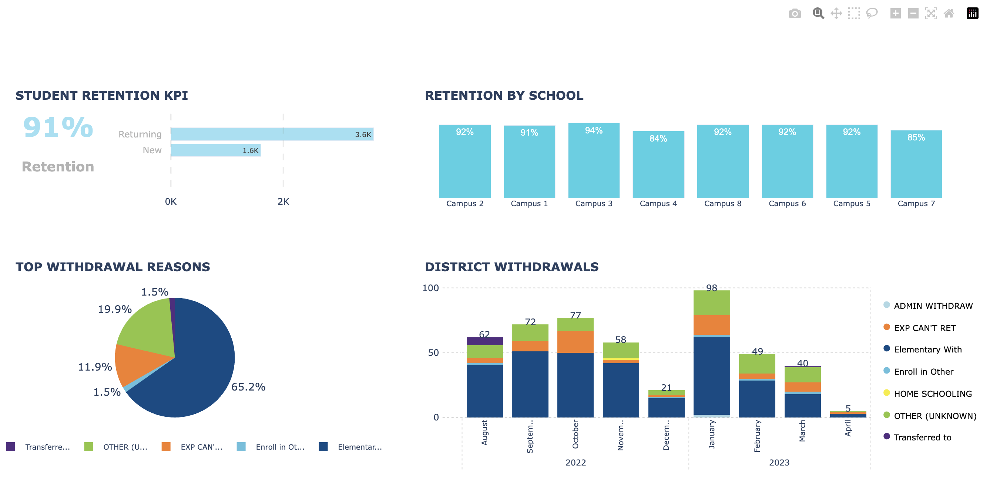

# Student Retention Dashboard (Python + Plotly)

Generates an interactive 2×2 dashboard from CSV/JSON data: KPI + composition bar (top-left), retention by school (top-right), top withdrawal reasons (pie) (bottom-left), and district withdrawals (stacked bars) (bottom-right).

**Tech:** Python 3.10+, Pandas, Plotly

## Screenshot
A preview of the generated dashboard (synthetic/demo data):

After running the steps below, the full interactive HTML will be created at outputs/retention_dashboard_preview.html and can be opened in your browser.

## Quickstart

# 1) Create and activate a virtual environment
python3 -m venv .venv && source .venv/bin/activate
python -m pip install --upgrade pip

# 2) Install dependencies
pip install -r requirements.txt

# 3) Build the dashboard -> outputs/retention_dashboard_preview.html
python scripts/viz.py

# 4) Open in your browser (macOS)
open outputs/retention_dashboard_preview.html

## Project structure:
scripts/
  data_gen.py      # creates JSON/CSV inputs in /data
  viz.py           # builds the HTML dashboard in /outputs
data/              # generated data files (JSON/CSV)
outputs/           # generated dashboard.html
requirements.txt   # dependencies
README.md          # this file

Notes:
All numbers are synthetic and for demonstration only.

License:
MIT
